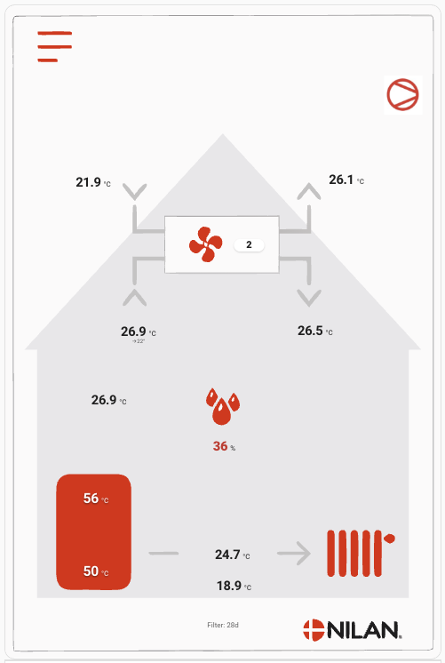

# Nilan HMI Card

A Home Assistant Lovelace custom card that replicates the **Nilan CTS602 HMI** front screen, with live values for every slot on the panel.

<p align="center">
  
</p>

Designed for users running the [Genvex Connect](https://github.com/superrob/genvexconnect) HACS integration on a Nilan Compact P (or similar Nilan/Genvex unit), but works with any entity set you wire up via the visual editor.

> Note: This project is not affiliated with Nilan A/S. All trademarks belong to their respective owners.

## Features

- Photo-accurate background of the original Nilan HMI screen with live HA overlays.
- All ~40 Genvex Connect entities supported as optional slots.
- **Visual editor** with one-click "auto-fill from device" for any Genvex Connect device.
- Tap any value to open the standard `more-info` dialog.
- Tap the **menu icon** to open a controls popup (target temperature, hot-water target, fan level, antilegionella, cooling priority, ...).
- Tap the **alarm icon** to see the active alarm list.
- Operation-icon strip (compressor, heat, cool, hot-water, defrost, stop, user program, week program, el-supplement) driven by configurable state maps.
- Per-slot overrides: label, unit, decimals, color, icon, thresholds, custom tap actions.
- English and Danish localisation.
- All assets bundled inside the JS file — install one file, done.

## Installation

### HACS (recommended)

1. In HACS, open the menu and add a custom repository:
   - URL: `https://github.com/msvinth/ha-nilan-card`
   - Category: `Dashboard`
2. Install **Nilan HMI Card**.
3. Refresh the dashboard. The resource is registered automatically by HACS.

[](https://my.home-assistant.io/redirect/hacs_repository/?owner=msvinth&repository=ha-nilan-card&category=plugin)

### Manual

1. Download `nilan-hmi-card.js` from the [latest release](https://github.com/msvinth/ha-nilan-card/releases).
2. Copy it to `<config>/www/`.
3. Add a Lovelace resource: URL `/local/nilan-hmi-card.js`, type `module`.

## Usage

In the dashboard, click **Add card → Custom: Nilan HMI Card**. Then in the visual editor:

1. Open the **General** section and pick your Genvex Connect device under **Source device** — entities are populated automatically.
2. Adjust slot visibility, labels, or behavior in the other sections.

### Minimal YAML

```yaml
type: custom:nilan-hmi-card
entities:
  temperature_room: sensor.nilan_temperature_room
  temperature_supply_air: sensor.nilan_temperature_supply_air
  temperature_outside_air: sensor.nilan_temperature_outside_air
  temperature_exhaust_air: sensor.nilan_temperature_exhaust_air
  humidity: sensor.nilan_humidity
  temperature_hotwater_top: sensor.nilan_temperature_hotwater_top
  fan_level_supply: sensor.nilan_fan_level_supply
  active_alarm_count: sensor.nilan_active_alarm_count
  active_alarm_list: sensor.nilan_active_alarm_list
  heatpump: binary_sensor.nilan_heatpump
  bypass: binary_sensor.nilan_bypass
  heating_element: binary_sensor.nilan_heatpump_heating_element
  climate: climate.nilan_ventilation
  temperature_target: number.nilan_temperature_target
  hotwater_temperature_target: number.nilan_hotwater_temperature_target
  fan_level: select.nilan_fan_level
```

All options are exposed in the visual editor with inline labels and helpers — start there and only hand-edit YAML if you need something the UI doesn't cover.

## Development

```sh
npm install
npm run dev     # rollup watch + dev server on :5000
npm run build   # production bundle to dist/nilan-hmi-card.js
npm run lint
```

To test against a real HA instance, register the dev server URL as a Lovelace resource: `http://<your-machine>:5000/nilan-hmi-card.js`.

## License

MIT — see [LICENSE](LICENSE).
